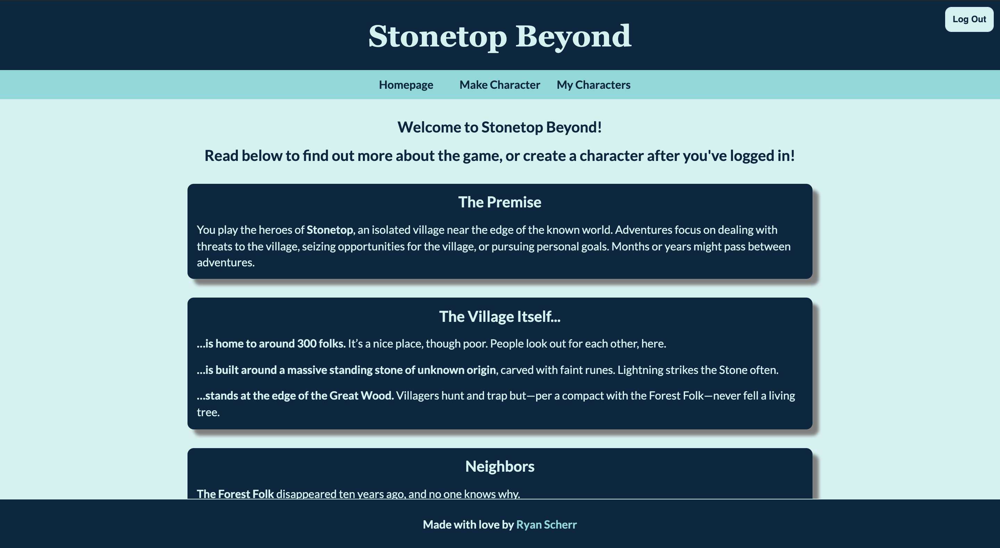

# Stonetop Beyond

## Description

This application allows users to create and view characters for Stonetop, a tabletop roleplaying game.

The application features login and signup functionality, characters tied to a user's account, the ability to update and delete characters, and automatic dice rolls based on a character's stats!

## Installation

There is no installation required to use this webpage.

## Usage

Users can use the navitgation tab at the top of the page to view the various sections of Ryan's amazing portfolio.

## Features

This application was created using MERN stack and features responsive design.

## Credits

Dan Rosenbaum

## Link

https://calm-basin-12509.herokuapp.com/

## Contact Information

ryanascherr@gmail.com
